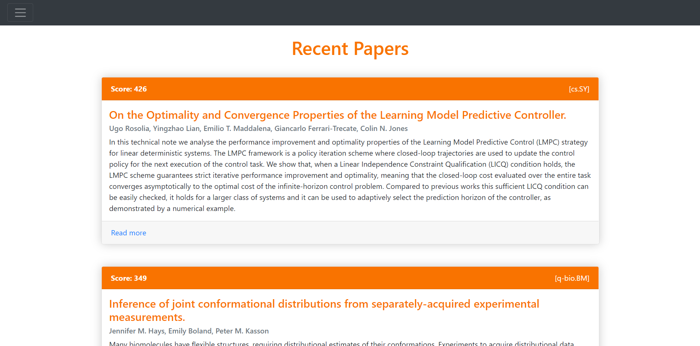

# arXiv impact forecast

Browsing through recent submissions on [_arxiv_](https://arxiv.org/) is a good way to keep up with the latest research but, due to the abundance of papers uploaded every day, it can also be a daunting task, especially when you are interested in many different subjects. This project therefore tries to predict the future impact of the most recent papers on _arxiv.org_ and presents them in a sorted order so that you can focus on the most important ones first.

1. [Setup](#setup)
    1. [Frontend](#frontend)
    2. [Backend](#backend)
2. [How-To](#how-to)
    1. [Requirements](#requirements)
    2. [Running the Code](#running-the-code)
    3. [Customization](#customization)

<p align="center">

</p>

## Setup
### Frontend
- minimalist design based on Bootstrap
- select arxiv categories of interest in a drop-down list
- the selection will be saved as a browser cookie for the next session
- the maximum number of included papers can be increased using the range slider (by default, only one paper is loaded per category to reduce processing time)

### Backend
- retrieves latest papers and authors from the _arXiv API_ (https://arxiv.org/help/api)
- rates the anticipated impact of each paper based on citations of the paper authors using the _Semantic Scholar API_ (https://www.semanticscholar.org/utm_source=api)

## How-To
### Dependencies
The following libraries are required to run the code in this repository:
- `flask` for providing a web server
- `beautifulsoup4` for parsing XML documents

### Running the Code
To host `index.html` locally, navigate to the working directory and run
``` bash
python backend.py
```
The website will be hosted at `http://127.0.0.1:5000/` by default.

The first time the backend is started, it will search for the available arxiv categories online which may take a while.
The startup time will be significantly lower in subsequent runs because previous results are reused.

Furtermore, the program needs some time to process all the papers each time the page is loaded or the settings are changed. 
A "growing spinner" is therefore displayed while the backend is still working.

### Customization
The provided code can be easily customized. In particular, the paper scoring function in `backend.py` can be replaced by any heuristic one deems useful. 